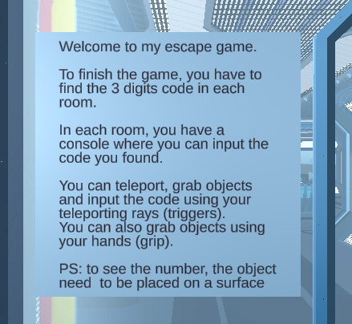
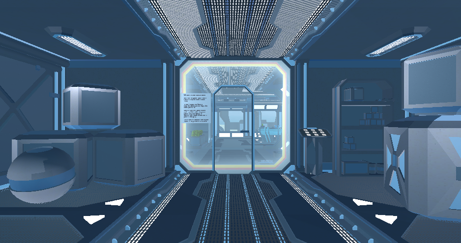
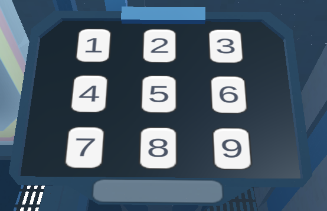
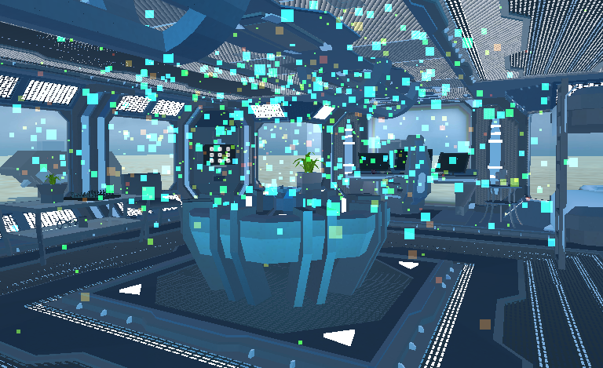

# Unity - VR Room

## Learning objectives

- What are the different types of locomotion / movement in VR
- What causes VR motion sickness
- What are the different methods of minimizing VR motion sickness in locomotion implementations
- How to implement a teleportation method of movement in VR
- How to implement interactive objects in VR

### Game Informations

### Starting Room

### Console in each room

### End game particules

